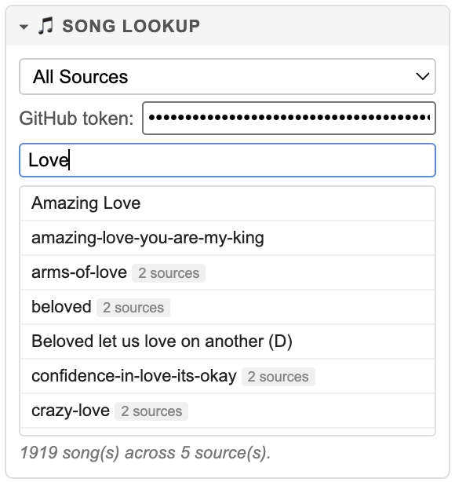
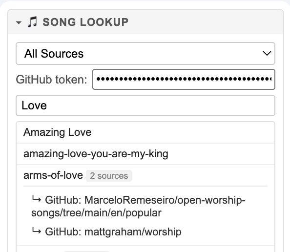
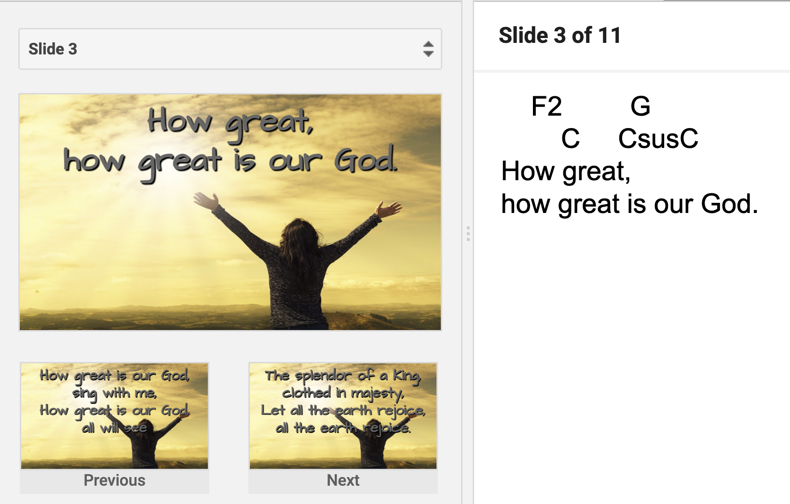
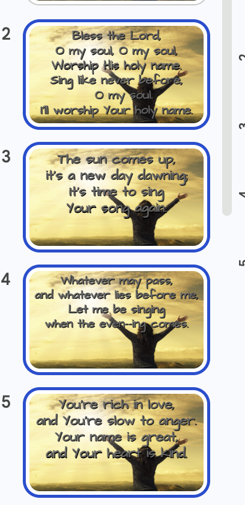
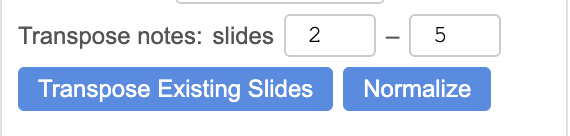
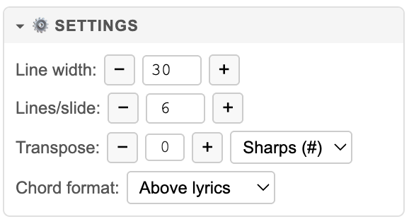

# ChurchSlidesMaker

Quickly and

Automatically create church presentation slides from song lyrics (with chords) and scripture passages.

---

## What it does

- **Song library** — search thousands of worship songs with chords from multiple free sources and load them in one click
- **Song lyrics** — paste chord+lyric text in chord-above or ChordPro inline `[Chord]` format; chords are stripped from slide bodies and preserved in speaker notes for the worship team
- **Transpose** — shift any song to a different key instantly, with your choice of sharps or flats
- **Scripture** — look up any passage by reference in KJV, ESV, or WEB; fetched and formatted automatically
- **Auto-scaling font** — slides automatically shrink the font to fit when a slide has more or longer lines than usual
- **Smart splitting** — long sections are distributed evenly across slides (8 lines → 4+4, never 6+2); wrapped lines always stay together

Slides are created by duplicating a template slide you design, so they automatically inherit your presentation's fonts, colors, and background.


|             Side panel             |            Generated slides            |
| :---------------------------------: | :------------------------------------: |
|  |  |

---

## Usage

### Choosing a template slide

Before creating slides you need a **template slide** — a slide you design once that all generated slides will be copied from. It must contain at least one text box, which is where the lyrics or scripture text will be placed.

Design your template slide with:

- The **background** you want (photo, solid color, gradient, etc.)
- The **font, size, and color** for the lyric/scripture text
- A **text box** sized and positioned where you want the words to appear
- A **note** with the font, size, and style you want for the presenter's notes (for song slides, the notes will contain the full lyrics and chords)

Then add a marker to the slide's **speaker notes** so ChurchSlidesMaker knows which slide is the template:

- `<<songs section>>` — marks the template for song slides
- `<<scriptures>>` — marks the template for scripture slides

Navigate to that slide in your presentation, **then** open the sidebar from the ChurchSlidesMaker menu. New song slides are appended to the end of the songs section, and new scripture slides are appended to the end of the scriptures section — so your presentation stays organized automatically.

> **Tip:** You can have both markers in the same presentation — one slide for songs, one for scripture — each with its own background and font style.

---

### Song library

Thousands of worship songs with chords are available for free from multiple sources. Use the **Song Lookup** section to find them.  You can



#### Sources

Select **All Sources** at the top of the source dropdown to search for songs across every configured source at once. Clicking a song loads it into the INPUT: Songs found in more than one source show a badge with the count; clicking the song expands an inline picker so you can choose which source to load from.


##### Choosing a Source

Clicking on the All Sources dropdown lists all the configured sources, allowing you to choose an individual source.


##### Adding a new Source

If you select "GitHub: Custom ..." then you can add a Github repo as a source by entering either a Github URL or repo name. Selecting 
All sources are stored privately in your own browser local storage.

#### Loading a song

1. Expand the **Song Lookup** section (the catalog loads on first open)
2. Type any part of a song title to filter
3. Click a song to load it into the Input box — or, for multi-source songs, click to expand and choose your preferred source

---

### Transposing to a different key

Transpose any song to the key that fits your team before creating slides:

1. Use the **−** / **+** buttons next to **Transpose** in the Settings section to set how many semitones to shift (shown as `+2`, `−3`, etc.)
2. Choose **Sharps (#)** or **Flats (♭)** to match your band's preference
3. The Output preview updates immediately — chords in both the slide body preview and the speaker notes are transposed

**Transpose Existing Slides** (in the Settings section) retransposes the chords already in the speaker notes of slides you've already created — useful if you decide to change keys after the fact. Set the slide range and click the button.

---

### Song lyrics

You can paste lyrics directly instead of (or in addition to) using the song library:

1. Paste chord+lyric text into the **Input** box — either chord-above format or ChordPro inline `[Chord]lyric` format
2. The **Output** box shows a preview with chords formatted above lyrics and lines wrapped to the configured width
3. Click **▶ Create Slides**

**What goes where:**

- Slide body — lyric lines only (chords stripped), font auto-scales to fit
- Speaker notes — full chord+lyric text, formatted for the worship team

**Chord format toggle:**

- *Above lyrics* — chords rendered on a separate line above each lyric line in the output and notes
- *Inline [chords]* — raw ChordPro notation preserved in notes; output shows lyrics only

**Slide splitting:**

- Songs break at `[Verse]`, `[Chorus]`, `[Bridge]` and other section labels
- Blank lines in the source force a new slide (use these to mark stanza boundaries)
- When a section needs multiple slides, lines are distributed evenly (e.g. 8 lines with Lines/slide=6 becomes 4+4, not 6+2)
- Chord+lyric pairs and wrapped line continuations are never split across slides

**During the presentation**, the worship team can follow along using Google Slides Presenter View — lyrics appear on screen for the congregation while chords and full text show in the speaker notes.



---

### Scripture

1. Expand the **Scripture Lookup** section
2. Type a reference (e.g. `John 3:16`, `Psalm 23`, `Romans 8:28-39`)
3. Choose a translation — **KJV**, **ESV**, or **WEB** (see note below)
4. Click **Look Up**
5. The formatted passage appears in the output — click **▶ Create Slides**

For multi-verse passages, a reference slide (e.g. *John 3:16–21*) is created first at a larger font size, followed by the content slides. Speaker notes on scripture slides are left blank but styled to match your template.

**Translation options:**

- **KJV** (King James Version) — free, no key required
- **WEB** (World English Bible) — free, no key required
- **ESV** (English Standard Version) — requires a free API key from [api.esv.org](https://api.esv.org); enter it in the ESV key field

---

### Slide tools

These tools operate on slides already in your presentation.



You can set the slide numbers manually by entering the exact slide numbers, or by selecting a range of slides as shown above and to the right. Whenever you select a range of slides, the numbers are automatically filled in for you.

**Transpose Existing Slides** — retransposes the chord lines in the speaker notes of the selected slides by the current Transpose amount. Useful when you decide to change key after slides have already been created. It transposes the lyrics in the Notes of the selected slides.  Clicking the "Transpost Existing Slides" button repeatedly, will change the key again. So you can set the transpose value to +1 or -1, and keep clicking until the chords are ideal for your voice and instruments.

**Normalize** -- distributes the formatting from the first slide in the selection to all selected slides



## Settings

In the Settings panel, you can specify the maximum line length for line-wrapping, and how many lines to fit into each slide.  Whether to place chords above the lyrics, or inline like this [Gm].  The transpose value will apply to all songs in the INPUT and will immediately be applied to the OUTPUT.  You can click the + or - signs and immediately see the changes in the OUTPUT.  The same transpose setting applies when transposing existing slides but does not happen until you click the button.



## Setup

1. Open (or create) a Google Slides presentation you want to use for church slides
2. Go to **Extensions → Apps Script**
3. Delete any default code in `Code.gs` and paste in the contents of `Code.gs` from this repo
4. Click **+** to add a new HTML file, name it exactly `Sidebar`, and paste in the contents of `Sidebar.html`
5. Add or replace `appsscript.json` with the one from this repo (you may need to enable "Show 'appsscript.json' manifest file in editor" in Project Settings first)
6. Save all files (**Ctrl+S** / **Cmd+S**), then close the Apps Script editor and **reload the presentation**
7. A **ChurchSlidesMaker** menu will appear in the menu bar — click **ChurchSlidesMaker → Open ChurchSlidesMaker**

> **Note:** If the menu is hidden, widen your browser window — Google Slides collapses menu items into a `…` overflow when the window is narrow.

---

## Local development with clasp

This project uses [clasp](https://github.com/google/clasp) to sync files between your local machine and Apps Script.

**Install Node.js first** (required for clasp):

```bash
# macOS — using Homebrew (recommended)
brew install node

# or download the installer from https://nodejs.org
```

**Then install clasp and log in:**

```bash
npm install -g @google/clasp
clasp login
```

**Day-to-day workflow:**

```bash
clasp push        # upload local changes to Apps Script
clasp pull        # download changes made in the online editor
```

The `.clasp.json` file contains the `scriptId` of the bound Apps Script project. To find yours: **Extensions → Apps Script → Project Settings (gear icon) → Script ID**.
