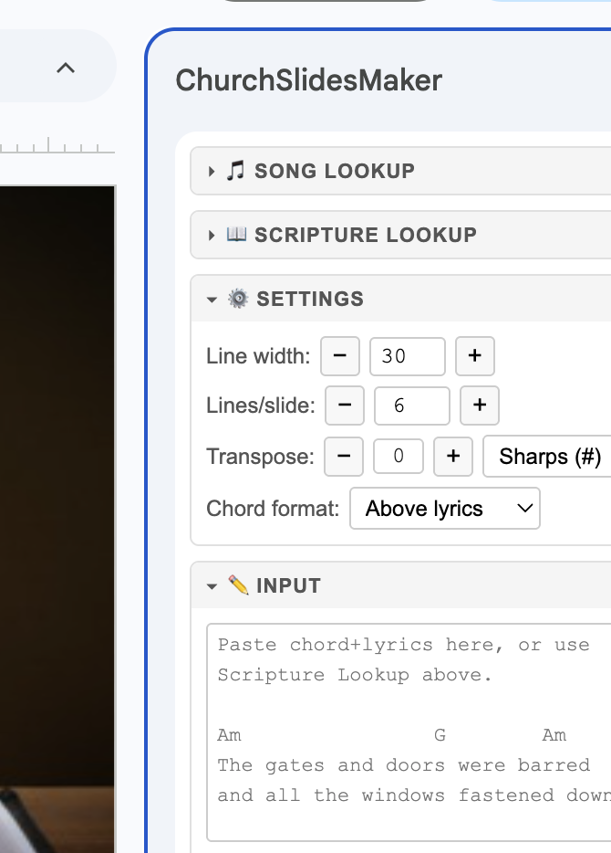
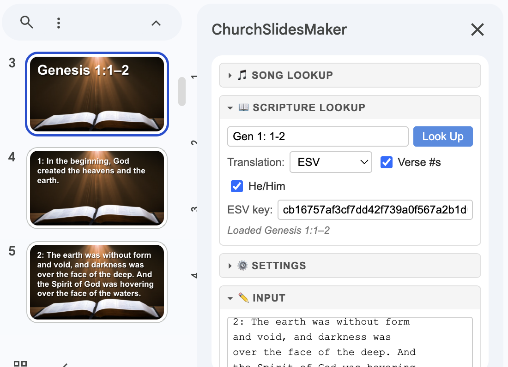
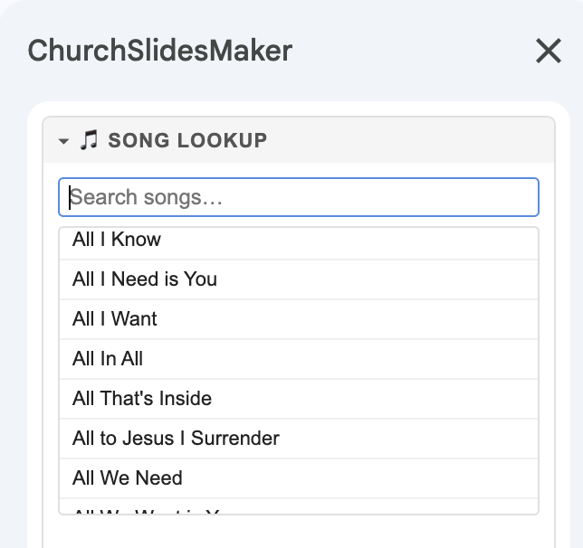
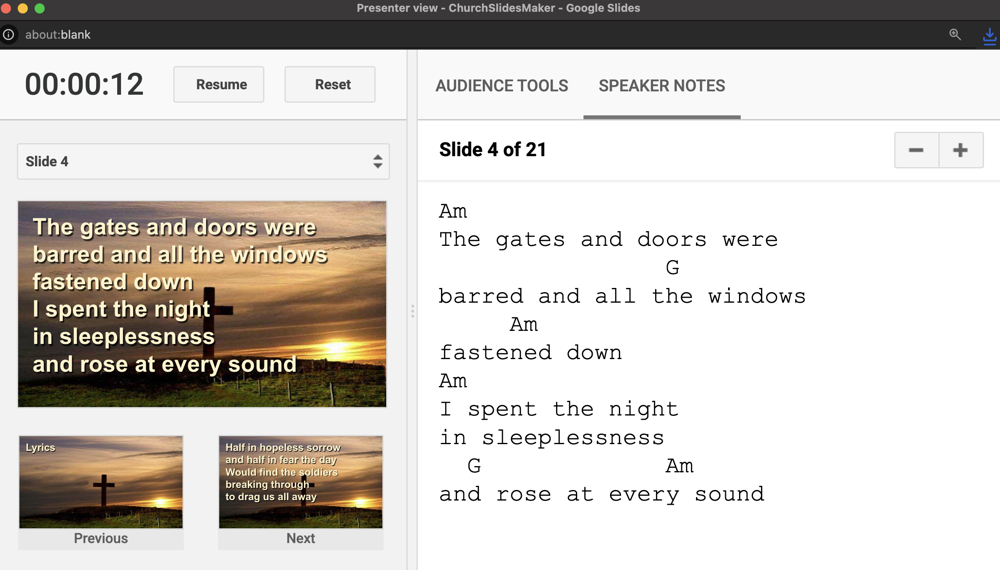

# ChurchSlidesMaker

A Google Apps Script sidebar for Google Slides that creates church presentation slides from song lyrics (with chords) and scripture passages.

---

## What it does

- **Song lyrics** — paste chord+lyric text in chord-above or ChordPro inline `[Chord]` format; chords are stripped from slide bodies and preserved in speaker notes for the worship team
- **Song library** — search thousands of worship songs with chords from the [mattgraham/worship](https://github.com/mattgraham/worship) OnSong library and load them in one click
- **Scripture** — look up any passage by reference in KJV, ESV, or WEB; the text is fetched and formatted automatically, with your choice of translation and verse number display
- **Transpose** — shift chords up or down any number of semitones, with sharps or flats

Slides are created by duplicating a template slide you choose, so they automatically inherit your presentation's fonts, colors, and background.

| Side panel | Generated slides |
|:---:|:---:|
|  |  |

---

## Usage

### Choosing a template slide

Navigate to the slide in your presentation whose background, fonts, and layout you want all new slides to inherit, **then** open the sidebar from the menu. The sidebar captures the current slide as the template when it opens.

### Song library

Thousands of worship songs with chords are available built-in:

1. Expand the **Song Lookup** section (loads the catalog on first open)
2. Type any part of a song title to filter
3. Click a song to load it into the Input box



Songs are sourced from the [mattgraham/worship](https://github.com/mattgraham/worship) repository in OnSong/ChordPro format.

### Song lyrics

You can also paste lyrics directly instead of using the song library:

1. Paste chord+lyric text into the **Input** box — either chord-above format or ChordPro inline `[Chord]lyric` format
2. The **Output** box shows a preview with chords formatted above lyrics and lines wrapped to the configured width
3. Click **▶ Create Slides**

**What goes where:**
- Slide body — lyric lines only (chords stripped)
- Speaker notes — full chord+lyric text (useful for the worship team)

**Chord format toggle:**
- *Above lyrics* — chords rendered on a separate line above each lyric line in the output and notes
- *Inline [chords]* — raw ChordPro notation preserved in notes; output shows lyrics only

**Slide splitting:**
- Songs break at `[Verse]`, `[Chorus]`, `[Bridge]` and other section labels
- Blank lines in the source force a new slide (use these to mark stanza boundaries)
- When a section needs multiple slides, lines are distributed evenly (e.g. 8 lines with Lines/slide=6 becomes 4+4, not 6+2)
- Chord+lyric pairs are never split; a chord line is always kept with its lyric line

**During the presentation**, the worship team can follow along using Google Slides Presenter View — lyrics appear on screen for the congregation while chords and full text show in the speaker notes.



### Scripture

1. Expand the **Scripture Lookup** section
2. Type a reference (e.g. `John 3:16`, `Psalm 23`, `Romans 8:28-39`)
3. Choose a translation — **KJV**, **ESV**, or **WEB** (see note below)
4. Click **Look Up**
5. The formatted passage appears in the output — click **▶ Create Slides**

For multi-verse passages, a reference slide (e.g. *John 3:16–21*) is created first at 1.7× font size, followed by the content slides.

**Translation options:**
- **KJV** (King James Version) — free, no key required
- **WEB** (World English Bible) — free, no key required
- **ESV** (English Standard Version) — requires a free API key from [api.esv.org](https://api.esv.org); enter it in the ESV key field

---

## Settings

| Setting | Description |
|---|---|
| **Line width** | Maximum characters per line before wrapping (default 30) |
| **Lines/slide** | Maximum lyric lines per slide before splitting (default 6) |
| **Transpose** | Semitones to shift all chords up (+) or down (−) |
| **Accidentals** | Use sharps (#) or flats (♭) when transposing |
| **Chord format** | Display chords above lyrics or inline in the output preview |

Scripture-specific options (in the Scripture Lookup section):

| Setting | Description |
|---|---|
| **Verse #s** | Show verse numbers (e.g. `16: For God so loved…`) |
| **He/Him** | Capitalize pronouns referring to God/Jesus |

---

## Setup

1. Open (or create) a Google Slides presentation you want to use for church slides
2. Go to **Extensions → Apps Script**
3. Delete any default code in `Code.gs` and paste in the contents of `Code.gs` from this repo
4. Click **+** to add a new HTML file, name it exactly `Sidebar`, and paste in the contents of `Sidebar.html`
5. Add or replace `appsscript.json` with the one from this repo (you may need to enable "Show 'appsscript.json' manifest file in editor" in Project Settings first)
6. Save all files (**Ctrl+S** / **Cmd+S**), then close the Apps Script editor and **reload the presentation**
7. A **ChurchSlidesMaker** menu will appear in the menu bar — click **ChurchSlidesMaker → Open ChurchSlidesMaker**

> **Note:** If the menu is hidden, widen your browser window — Google Slides collapses menu items into a `…` overflow when the window is narrow.

---

## Local development with clasp

This project uses [clasp](https://github.com/google/clasp) to sync files between your local machine and Apps Script.

**Install Node.js first** (required for clasp):

```bash
# macOS — using Homebrew (recommended)
brew install node

# or download the installer from https://nodejs.org
```

**Then install clasp and log in:**

```bash
npm install -g @google/clasp
clasp login
```

**Day-to-day workflow:**

```bash
clasp push        # upload local changes to Apps Script
clasp pull        # download changes made in the online editor
```

The `.clasp.json` file contains the `scriptId` of the bound Apps Script project. To find yours: **Extensions → Apps Script → Project Settings (gear icon) → Script ID**.
